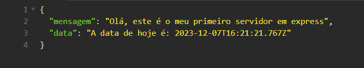

# Meu primeiro servidor com o express. (Cubos Academy)

## O que é esse projeto?

    -👩‍💻 Este é o meu primeiro projeto de servidor usando o express.js.

## Como rodar o servidor?

    -💻 Para rodar o servidor basta executar no terminal o comando "node ./src/index.js" ou se preferir, pode usar o nodemon com o comando "npm run ("script")"

## Exemplo:

### É isso!, Valeu!!!
